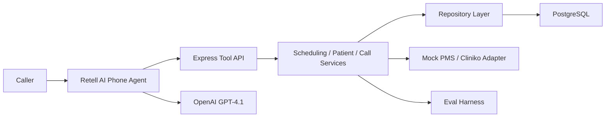

# Voice AI Receptionist Assignment

Production-style Voice AI receptionist for a real clinic scenario: appointment booking, rescheduling, cancellation, live availability lookup, cross-branch search, returning patient recognition, missed callback recovery, dropped call recovery, Hindi/English/code-switching behavior, mock PMS write-back, and a re-runnable evaluation harness.

This repository is GitHub-ready. External live deployment still requires secrets and account setup for Retell, OpenAI, Postgres hosting, and a callable phone number.

## Stack

- Backend: Node.js, Express, TypeScript
- Database: PostgreSQL with Prisma ORM
- Voice platform: Retell AI
- LLM: OpenAI `gpt-4.1`
- Validation: Zod
- Logging: Pino with request IDs
- Deployment: Docker, Railway, Render
- Evaluation: scripted multi-turn harness with per-language metrics

## Why Retell

I chose Retell over Bolna because this assignment is weighted toward production telephony behavior: barge-in/interruption handling, realistic voices, live phone-number testing, and reliable tool calls during a call. Retell gives a strong hosted voice-agent path with lower integration burden for telephony, configurable tools, and practical multilingual voice behavior. Bolna is attractive when owning more of the stack matters, but for a 3-day clinic receptionist assignment the production-ready tradeoff is to use Retell and put engineering effort into backend correctness, state recovery, idempotency, and eval coverage.

## Clinic Data

The seed data uses NU Hospitals as the real clinic basis because it has multiple Bengaluru branches and publicly listed specialties/doctors. Public appointment-slot inventory is not available without clinic/PMS credentials, so availability windows are seeded as replaceable operational data and the adapter is ready to swap to Cliniko.

See [docs/data-sources.md](docs/data-sources.md).

## Architecture



Why this architecture:

- Retell owns telephony and streaming voice behavior.
- The backend owns all durable state and correctness.
- Tool calls are scoped and deterministic so the LLM cannot invent availability.
- Prisma transactions plus a PostgreSQL partial unique index prevent active double booking.
- PMS write-back is idempotent and failure creates a pending follow-up instead of silently dropping a confirmed appointment.

## Core Features

- Booking with live availability re-check before write
- Rescheduling with fee-window logic only when applicable
- Cancellation with fee-window logic only when applicable
- Conflict resolution and alternative slot lookup
- Cross-branch earliest-slot search
- Branch-specific specialty search
- Returning-patient lookup
- Shared family phone disambiguation
- Missed outbound callback recovery
- Dropped-call recovery
- Conversation history and state storage
- Audit logs
- Multilingual prompt for English, Hindi, and code-switching
- Retell tool schema endpoints
- Mock PMS write-back API with idempotency
- Evaluation harness with per-language reporting

## How To Run Locally

1. Copy environment variables:

```bash
cp .env.example .env
```

2. Start Postgres:

```bash
docker compose up -d postgres
```

3. Install dependencies:

```bash
npm install
```

4. Run migrations and seed data:

```bash
npm run prisma:generate
npm run db:migrate
npm run db:seed
```

5. Start the API:

```bash
npm run dev
```

6. Check health:

```bash
curl http://localhost:8080/health
curl http://localhost:8080/ready
```

## API Entry Points

- `POST /api/voice/tools/start-call`
- `POST /api/voice/tools/identify`
- `POST /api/voice/tools/availability`
- `POST /api/voice/tools/book`
- `POST /api/voice/tools/reschedule`
- `POST /api/voice/tools/cancel`
- `POST /api/voice/tools/call-event`
- `POST /api/voice/tools/escalate`
- `POST /api/availability/search`
- `POST /api/appointments`
- `GET /api/appointments/:id`
- `POST /api/appointments/:id/reschedule`
- `POST /api/appointments/:id/cancel`
- `POST /api/patients/identify`

Full docs: [docs/api.md](docs/api.md)

## Retell Tool Setup

Configure Retell tools to call:

- `APP_BASE_URL/api/voice/tools/start-call`
- `APP_BASE_URL/api/voice/tools/identify`
- `APP_BASE_URL/api/voice/tools/availability`
- `APP_BASE_URL/api/voice/tools/book`
- `APP_BASE_URL/api/voice/tools/reschedule`
- `APP_BASE_URL/api/voice/tools/cancel`
- `APP_BASE_URL/api/voice/tools/call-event`
- `APP_BASE_URL/api/voice/tools/escalate`

Use the prompt in [docs/prompt.md](docs/prompt.md). The source copy also lives in [src/prompts/voiceAgentPrompt.ts](src/prompts/voiceAgentPrompt.ts).

## Evaluation Harness

Run after the API is up and seeded:

```bash
npm run eval
```

The harness covers:

- English earliest-slot cross-branch search
- Hindi shared phone disambiguation
- Mixed-language dropped-call recovery
- Stale availability re-check
- Hindi branch specialty lookup
- Missed callback recovery
- Idempotent booking
- Underspecified afternoon time lookup

It writes JSON reports to `eval-results/`.

## Documentation Index

- [Architecture](docs/architecture.md)
- [System Design](docs/system-design.md)
- [Database ERD](docs/database-er.md)
- [Folder Structure](docs/folder-structure.md)
- [Prompt](docs/prompt.md)
- [Prompt Logic](docs/prompt-logic.md)
- [API Documentation](docs/api.md)
- [Environment Variables](docs/environment.md)
- [Deployment Guide](docs/deployment.md)
- [Testing Guide](docs/testing.md)
- [Latency Analysis](docs/latency-analysis.md)
- [Performance Report](docs/performance-report.md)
- [Known Limitations](docs/known-limitations.md)
- [Future Improvements](docs/future-improvements.md)
- [Assignment Checklist](docs/assignment-requirements-checklist.md)
- [Email Submission Template](docs/email-submission-template.md)
- [Interview Notes](docs/interview/overview.md)

## Final Deliverables Checklist

- Complete backend project: yes
- README: yes
- Architecture diagram: yes
- Database ER diagram: yes
- Folder structure explanation: yes
- Voice agent prompt: yes
- Prompt logic explanation: yes
- API docs: yes
- Environment docs: yes
- Postman collection: yes
- Docker setup: yes
- Deployment guide: yes
- Testing guide: yes
- Interview notes: yes
- Known limitations: yes
- Future improvements: yes
- System design doc: yes
- Evaluation harness: yes
- Latency analysis: yes
- Performance report: yes
- Local run guide: yes
- Deployment guide: yes
- Email template: yes

## Known Limitations

- Live phone number provisioning cannot be completed without Retell account credentials.
- Real Cliniko write-back needs clinic credentials; this repo includes a mock PMS and a clean adapter boundary.
- Seeded appointment windows are operational test data, not live NU Hospitals inventory.
- Local eval estimates ASR/TTS latency; live Retell traces should replace these estimates.

