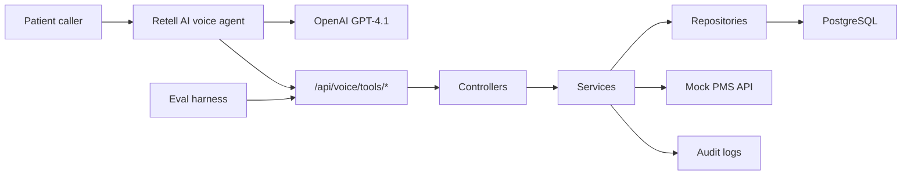

# Architecture

## Runtime View

## Why This Approach

The backend is the source of truth. Retell and the LLM can ask questions and call tools, but they do not decide whether a slot exists or whether a booking is safe. That prevents cached tool results or hallucinated availability from becoming confirmed appointments.

## Alternatives

- Put scheduling state inside the Retell prompt: faster to demo, but fragile after dropped calls and impossible to audit.
- Use an in-memory store: easy locally, but fails the real-datastore and recovery requirements.
- Build full WebRTC/LiveKit stack: more control, but too much infrastructure for the assignment timeline.

## Tradeoffs

- Retell reduces telephony risk but creates vendor dependency.
- Prisma accelerates schema and transaction work but raw SQL is still used for the partial unique index.
- Mock PMS makes the repo runnable from a clean clone, while the adapter boundary keeps Cliniko migration straightforward.

