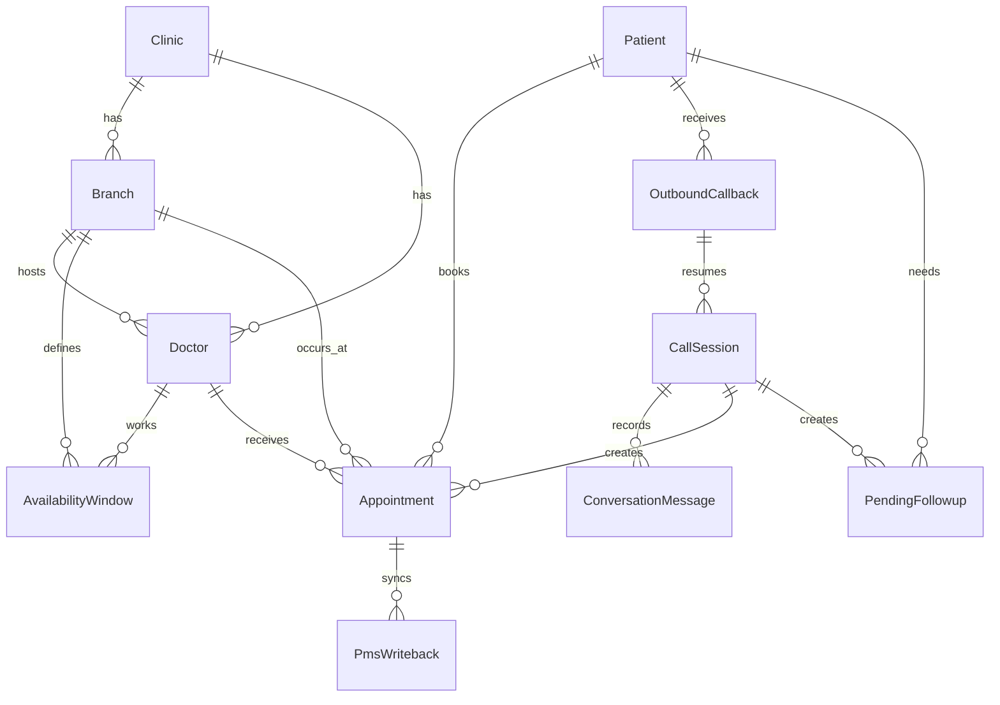

# Database ER Diagram

## Concurrency

The database prevents double booking with:

- live conflict query in the transaction
- PostgreSQL partial unique index on `Appointment(doctorId, startAt, endAt)` where status is `HELD` or `CONFIRMED`
- idempotency key on appointment writes

Cancelled and rescheduled appointments do not block the slot forever because the uniqueness rule applies only to active statuses.

